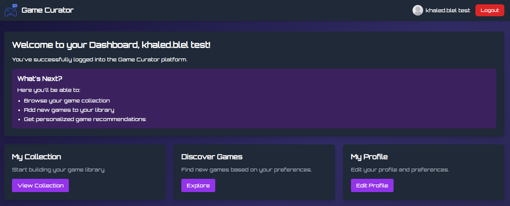
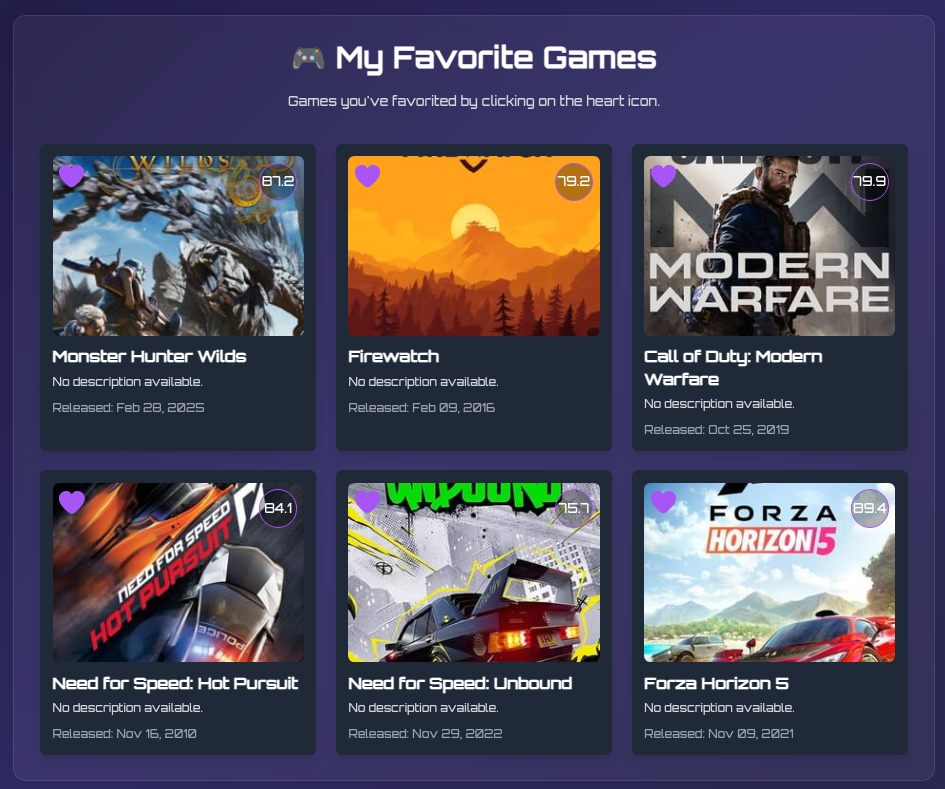
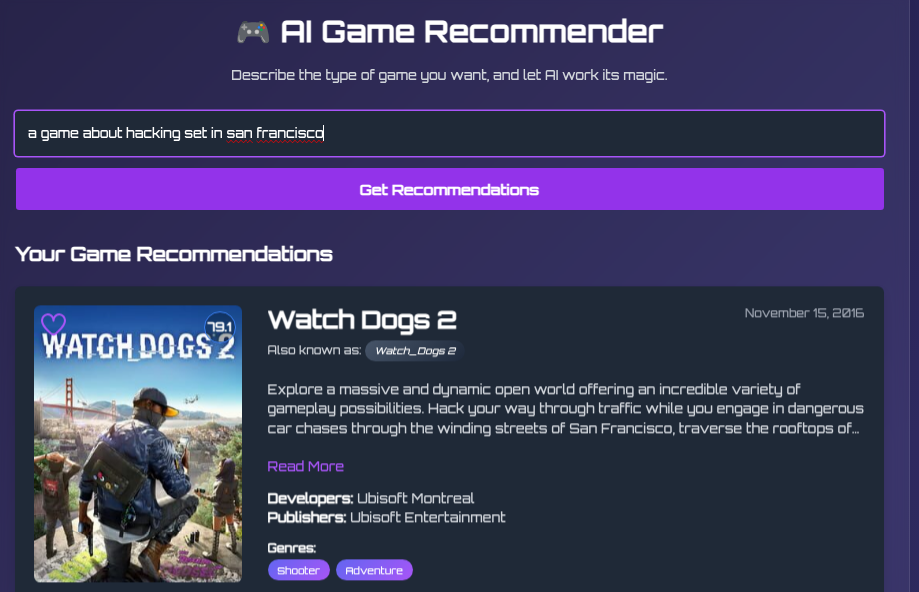
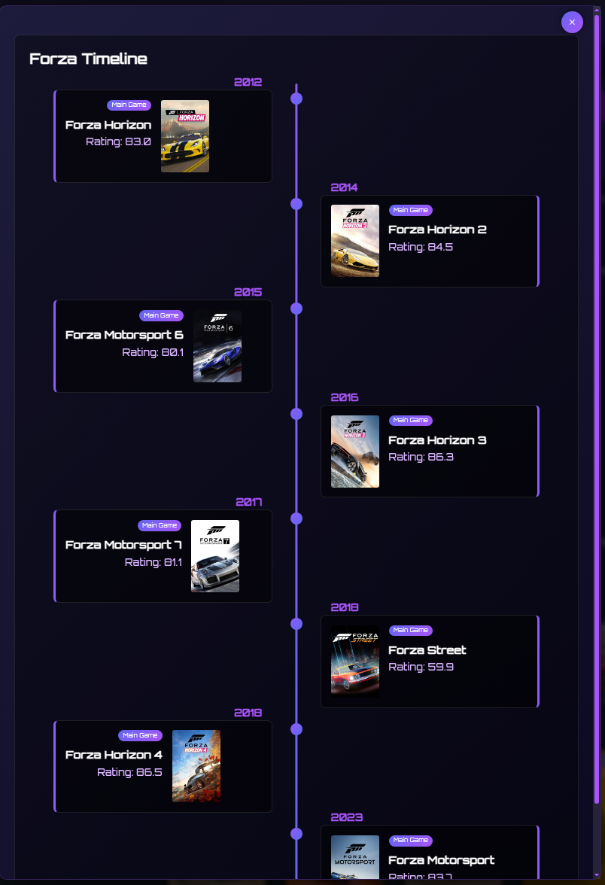
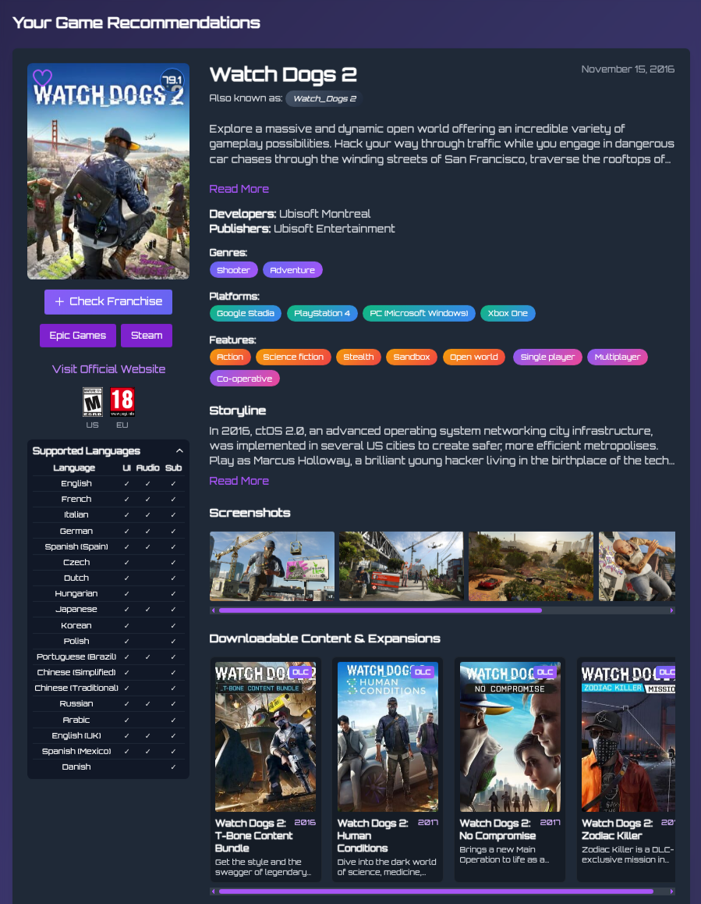

<div align="center">
  

  # Game Curator

  [](https://www.php.net/)
  [](https://www.mysql.com/)
  [](https://tailwindcss.com/)
  [](https://deepmind.google/technologies/gemini/)

  > **A personalized game recommendation engine powered by Generative AI.**
</div>

<br />

## 📖 Overview

**Game Curator** is an intelligent web application that solves the "what should I play next?" dilemma. By leveraging **Google's Gemini AI** for natural language understanding and **IGDB's** comprehensive game database, it offers personalized game suggestions tailored to your specific tastes, mood, and requirements.

## ✨ Features

*   🧠 **AI-Powered Recommendations**: Describe what you want to play in plain English, and let Gemini find the perfect match.
*   🎯 **Smart Filtering**: Utilizing IGDB data to filter matches by genre, platform, and availability.
*   ❤️ **Favorites Collection**: Save your best discoveries to your personal library.
*   🔐 **Secure Authentication**: Robust user registration and session-based login system.
*   📱 **Responsive Interface**: A modern UI built with Tailwind CSS that works seamlessly across desktop and mobile.

## 📸 Screenshots

| Dashboard | Favorites Page |
|:---:|:---:|
|  |  |

| AI Recommender Interface | Franchise Timeline | Game Details |
|:---:|:---:|:---:|
|  |  |  |

## 🛠️ Technologies Used

### Backend
*   **PHP 8.4**: Native PHP implementation for robust server-side logic.
*   **Composer**: Dependency management.

### Database
*   **MySQL**: Relational database for storing user profiles and favorites.

### AI & External Services
*   **Google Gemini AI**: Implemented via cURL REST calls for processing natural language prompts.
*   **IGDB API**: External source for fetching real-time game metadata, covers, screenshots, and platform info.

### Frontend
*   **Tailwind CSS**: Utility-first CSS framework for rapid UI development.
*   **Vanilla JavaScript**: Lightweight client-side interactivity and AJAX handling.

## 🎮 IGDB API Endpoints

The application currently uses the following IGDB API endpoints:

- **/games**: Fetches basic game information and metadata
- **/covers**: Retrieves game cover images
- **/genres**: Gets genre information for categorization
- **/platforms**: Obtains platform availability data
- **/companies**: Retrieves publisher and developer information

API documentation: [IGDB API Docs](https://api-docs.igdb.com/)

## 🚀 Getting Started

Follow these instructions to set up the project on your local machine.

### Prerequisites

Ensure you have the following installed:
- **PHP 8.2+** (Ensure `cURL` and `mysqli` extensions are enabled)
- **MySQL** or **MariaDB**
- A web server (Apache, Nginx, or PHP's built-in server)

You will also need API keys for:
- [Google AI Studio (Gemini)](https://aistudio.google.com/)
- [Twitch Developer Portal (IGDB)](https://dev.twitch.tv/console)

### Installation

1. **Clone the repository**
   ```bash
   git clone https://github.com/yourusername/game-curator-php.git
   cd game-curator-php
   ```

2. **Database Setup**
   - Create a new MySQL database (e.g., `gcdb`).
   - **Configuration**: Rename `config/database.example.php` to `config/database.php` (if applicable) or create it with your credentials:
     ```php
     <?php
     function get_db_connection() {
         $conn = new mysqli("localhost", "root", "password", "gcdb");
         if ($conn->connect_error) die("Connection failed: " . $conn->connect_error);
         return $conn;
     }
     ?>
     ```
   - **Initialization**: The application attempts to create necessary tables automatically via `config/db_init.php` when you first run it. Alternatively, import `database/schema.sql` manually.

3. **API Configuration**
   
   **Google Gemini:**
   Open `gemini_api.php` and replace the placeholder key:
   ```php
   $api_key = "YOUR_GEMINI_API_KEY_HERE";
   ```

   **IGDB:**
   Open `igdb_api.php` and set your IGDB/Twitch credentials:
   ```php
   $client_id = "YOUR_IGDB_CLIENT_ID";
   $client_secret = "YOUR_IGDB_CLIENT_SECRET";
   // Use these to obtain an access token and authenticate IGDB API requests
   ```

4. **Run the Application**
   
   Start the local PHP server:
   ```bash
   php -S localhost:8000
   ```

   The application will be available at [http://localhost:8000](http://localhost:8000).

## 🧰 Project Structure

```
game-curator-php/
├── assets/                  # Contains images, icons, and other assets
├── config/                  # Configuration files
│   ├── database.php         # Database connection settings
│   └── db_init.php          # Database initialization script
├── gemini_api.php           # Google Gemini API integration
├── igdb_api.php             # IGDB API integration
├── index.php                # Entry point for the application
├── README.md                # Project documentation
└── ...                      # Other PHP, CSS, JS files
```

## 🙏 Acknowledgements

- [PHP](https://www.php.net/) - The language used
- [Tailwind CSS](https://tailwindcss.com/) - For the beautiful UI
- [IGDB API](https://www.igdb.com/api) - For providing the game data
- [Google Gemini](https://ai.google/discover/gemini/) - For AI-powered recommendations

---

**Game data and imagery provided by [IGDB API](https://www.igdb.com/api).**

**This project is for educational/portfolio purposes only. All game images and trademarks are the property of their respective owners. This site is non-commercial and not intended for any paid use.**

---

Looking for the Django version?  
👉 [Khaledblel/game-curator-django](https://github.com/Khaledblel/game-curator-django)

---

Made with ❤️ by Khaled